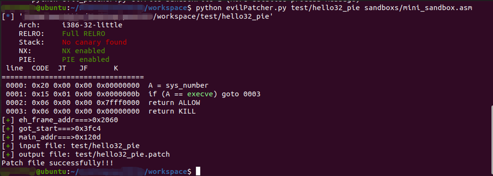
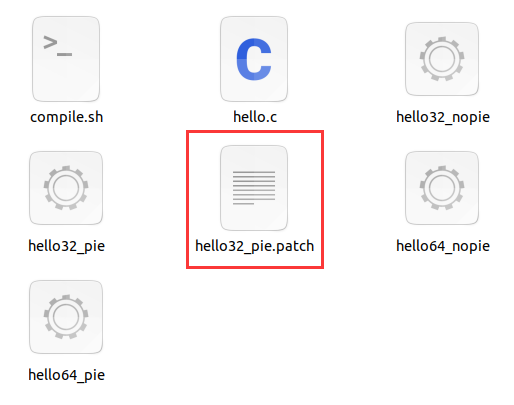
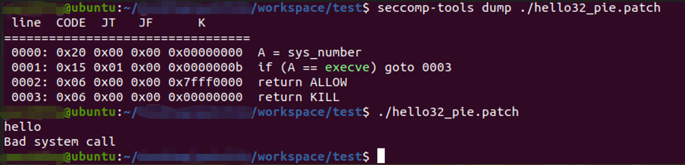

# 基于pwntools和seccomp-tools的awd pwn通防小工具

​	最初想法是想找到一种不影响程序本身运行，但是能够给程序禁用一些系统调用（execve、open等）来实现通防的方法。看了网上很多资料，感觉没有找到比较理想的解决方案，有一些是环境都搭不起来，有一些工具对文件本身内容改动太大了（加段），而awd中假如check的脚本是本地运行的话是有可能check文件修改字节数的。那就只能自己动手，丰衣足食了。


## 工具说明

### 特点

- 修改的字节数少，0x100字节以下
- 不修改文件头信息
- 沙箱规则可以自己定义
- 支持i386和amd64
- 支持pie开启和未开启情况

注：已在ubuntu16、18、20上测试过默认版本gcc编译出的程序，通过；暂不支持g++编译出的程序。

### 环境需求

​	**默认环境为python3，python2环境请切换至py2分支** https://github.com/TTY-flag/evilPatcher/tree/py2

​	运行需要依赖seccomps-tools和pwntools

​	pwntools https://github.com/Gallopsled/pwntools

​	seccomps-tools https://github.com/david942j/seccomp-tools

### 目录说明

**sandboxs文件夹**

​	sandboxs里面存放了禁用的规则，这里根据自己的需要进行修改和选择。

实例（sandbox1.asm）

```
A = sys_number
A >= 0x40000000 ? dead : next
A == execve ? dead : next
A == open ? dead : next
return ALLOW
dead:
return KILL
```

**test文件夹**

​	执行`./complie.sh`生成四个可执行文件可供测试，分别是64/32位和pie开启/关闭的排列组合。


### 运行脚本命令

​	第一个参数是需要patch的elf文件，第二个参数是沙箱规则文件，可以从sandboxs文件夹里选，假如想输出更多的中间过程可以在最后参数加上一个1。（已自动识别32位和64位）

```
Usage: python evilPatcher.py elfFile sandboxFile
       python evilPatcher.py elfFile sandboxFile 1 (more detailed process message)
```

**运行**



​	结果输出一个patch过后的文件，文件名为原来文件加上.patch后缀，再改回原来的名字就可以传到靶机上了。



**验证**




**更多细节**

https://bbs.pediy.com/thread-273437.htm
